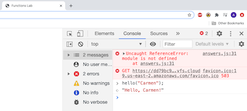
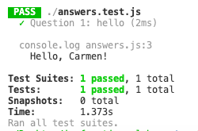

# Simple Functions Lab

This lab aims to give you more practice writing functions and solving problems.

## Instructions

As you're writing your functions, it's important to code a little and test a little. It's easier to fix a few bugs at a time than to have to fix a ton of bugs at the end. There are three ways in which you can test your code.

    * Using the browser
    * Using `node`
    * Using the automatic test cases your instructors have provided

## Question 1 Walkthrough

Code along as we show you how to solve Question 1. Write a function that takes a name and **returns** a greeting with `"Hello"` and the person's name.

Example:
```javascript
hello("Carmen"); // "Hello, Carmen!"
```

In your code in the `answers.js` file, write:
```javascript
function hello(name) {
  return `Hello, ${name}!`;
}
```

### Testing using the Browser

To test your code using the browser, open your `index.html` in a new tab. Because your HTML has a `<script>` tag to your JavaScript file, they are linked together. Open the console in your HTML webpage and *invoke* the function to verify it has the expected output. You can ignore the error about `module is not defined` and the error about `Failed to load resource`.



### Testing using node

You can run JavaScript outside the browser using the command `node <path_to_file>`. From your terminal, you must be in the project folder where `answers.js` is located. Then you can run the file from the terminal with `node answers.js`. 

**However, this will not print anything out yet!**

We declared our function but we never *invoked* it! We can invoke functions in browser's console, but we can't invoke functions in terminal. Instead, we must *invoke the function* in the file itself, then run the file. Update your code in `answers.js` to *invoke* the function:

```javascript
hello("Carmen"); // Remember hoisting is a thing ;)

// Question 1
function hello(name) {
  return `Hello, ${name}!`;
}
```

*Save your file.* If we run `nodes answer.js`, we get... still nothing...

Although we have invoked the function, we never tell our program to *do anything* with the function's **return value**. Let's make a change to *print* out the return value of our function:

```javascript
console.log( hello("Carmen") ); // Logs "Hello, Carmen!"

// Question 1
function hello(name) {
  return `Hello, ${name}!`;
}
```

*Save your file.* Now run `node answers.js` in the terminal to see the expected output.

### Testing using Automated Test Cases

Your instructors have written some test cases in the file `answers.text.js`. DO NOT change anything in this file. These tests cases are very similar to the test cases you might have seen on CodeWars.

From the terminal run `npm install` to install dependencies. You only have to run this command once per lab/assignment.

Then run `npm test` to see the results.



## Coding Exercises

1. Write a function that takes a name and **returns** a greeting with `"Hello"` and the person's name.

    Example:
    ```javascript
    hello("Carmen"); // "Hello, Carmen!"
    hello("Devonte"); // "Hello, Devonte!"
    hello("Reuben Ogbonna"); // "Hello, Reuben Ogbonna!"
    ```

2. Write a function that takes in two numbers and returns the product (multiple those numbers together):

    Examples:
    ```javascript
    findProduct(5, 7); // 35
    findProduct(15, 10); // 150
    findProduct(25.75, 42); // 1081.5
    ```
    
3. Write a function that returns the area of a square when given one side as the input:

    Examples:
    ```javascript
    getSquare(5); // 25
    getSquare(4); // 16
    getSquare(3); // 9
    ```

4. Write a function that takes in a number and returns the opposite of that number. If the original number is positive, return the negative version of that number. If the original number is negative, return the positive veresion of that number.

    Examples:
    ```javascript
    makeOpposite(9); // -9
    makeOpposite(-3); // 3
    makeOpposite(5.78); // -5.78
    ```

5. Write a function that **logs** all even numbers from 0 to 50, inclusive, to the console. Log all numbers on separate lines. Then, this function should **return** the string, `"Why is 6 afraid of 7?"`.

    Example:
    ```javascript
    logEvenNumbers(); // "Why is 6 afraid of 7?"

    /* Printed to the Console */
    // 0
    // 2
    // 4
    .
    .
    .
    // 48
    // 50
    ```

6. Write a function that returns the sum of all numbers between 1 and some other number, inclusive, that are multiples of 4 or 7. For example, if the supplied number is 17, the result should be 61 (4 + 7 + 8 + 12 + 14 + 16).

    You may assume that the number passed in is an integer greater than 1.

    Examples:
    ```javascript
    sumFoursAndSevens(17); //(4 + 7 + 8 + 12 + 14 + 16) => 61
    sumFoursAndSevens(21); //(4 + 7 + 8 + 12 + 14 + 16 + 20 + 21) => 102
    ```
    
7. Write a function that takes one argument, a positive integer, and returns a string of alternating `'X'`s and `'O'`s, always starting with a `'X'`. The length of the string should match the given integer.

    Examples:
    ```javascript
    exsAndOhs(6);    // "XOXOXO"
    exsAndOhs(9);    // "XOXOXOXOX"
    exsAndOhs(4);    // "XOXO"
    exsAndOhs(7);    // "XOXOXOX"
    ```

## Challenge functions:

There are no automated test cases for the following problems. You will be responsible for testing them yourselves manually, either using the browser or `node`.

1. Write a function `weirdString()` that takes in a string and returns a copy of that string with every vowel removed, and then of the remaining letters, every other letter alternates between lowercase and uppercase.

```javascript
weirdString("hello world") // "hLl wRlD"
weirdString("Reuben Ogbonna") // "rBn gBnN"
weirdStsring("Maya Bhattacharjee-Marcantonio") // "mY BhTtChRj-mRcNtNi"
```

2. Write a function `possibleSums()` that takes in an integer. It returns an array of all possible sums of every two digits combination within that number. 

For example, given the number `12345`, all possible sums of every two digit combination from that number are:

`[ 1 + 2, 1 + 3, 1 + 4, 1 + 5, 2 + 3, 2 + 4, 2 + 5, 3 + 4, 3 + 5, 4 + 5 ]`

So the function should return `[ 3, 4, 5, 6, 5, 6, 7, 7, 8, 9 ]`.
